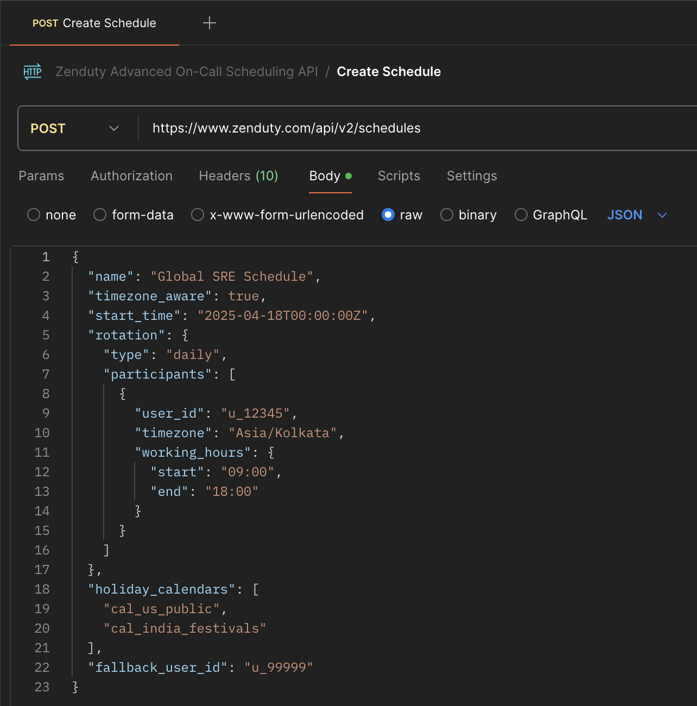
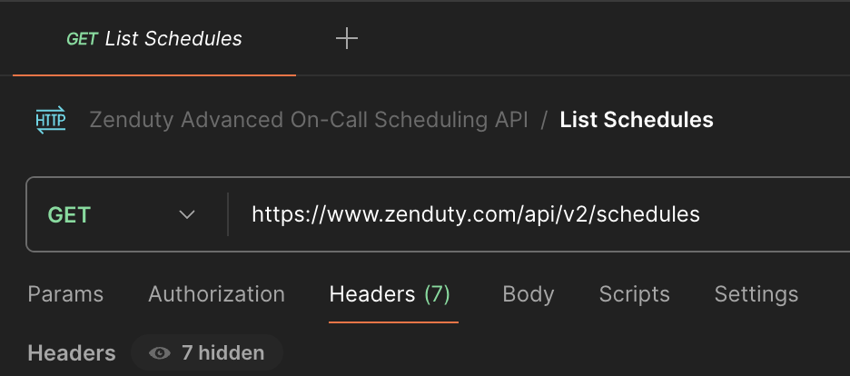
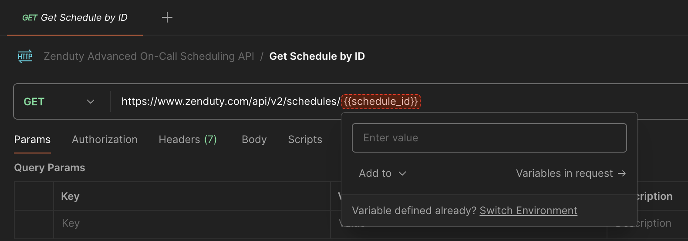
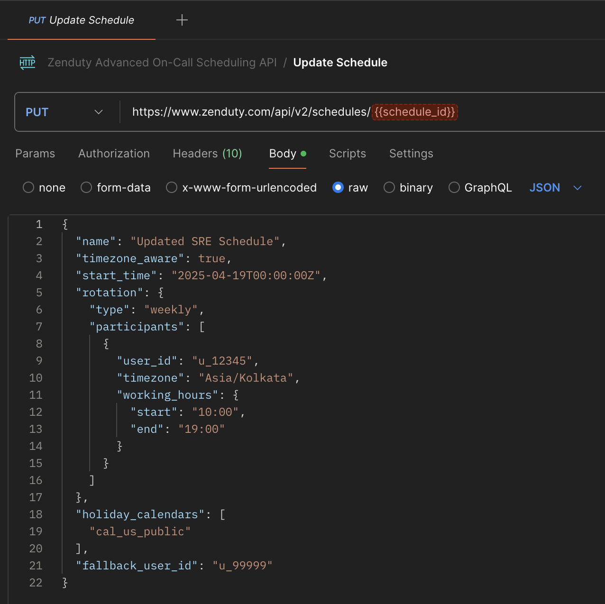
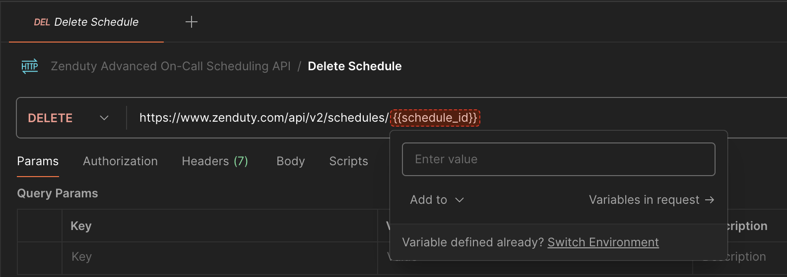

# Zenduty Advanced On-Call Scheduling with Timezone Intelligence

## Overview

Zenduty now supports advanced on-call scheduling with timezone intelligence. This feature makes it easier for teams working in different parts of the world to manage shifts and escalations fairly and efficiently.

---

## What’s New

- **Timezone-Aware Scheduling** — Each participant can be assigned a timezone and working hours.
- **Custom Rotations** — Support for daily, weekly, and custom rotation patterns.
- **Holiday Calendars** — Add national or regional holiday calendars to skip rotations on holidays.
- **Fallback User Support** — Automatically assign a fallback user when no one is available.

---

## Available API Endpoints

You can interact with these features through the following endpoints:

1. **Create Schedule**  
   `POST /api/v2/schedules`  
   Create a new schedule with timezone-aware participants.

   

3. **List Schedules**  
   `GET /api/v2/schedules`  
   Get all existing schedules.

   

5. **Get Schedule by ID**  
   `GET /api/v2/schedules/{schedule_id}`  
   Retrieve details of a specific schedule.

   

7. **Update Schedule**  
   `PUT /api/v2/schedules/{schedule_id}`  
   Modify an existing schedule.

   

9. **Delete Schedule**  
   `DELETE /api/v2/schedules/{schedule_id}`  
   Remove a schedule.

   

You can import our Postman collection to start testing all endpoints. Each request comes with pre-filled example data and supports easy authentication setup.

[Download Postman Collection](Zenduty-Advanced-On-Call-Scheduling-API.postman_collection.json)

Need help? Join our [community](https://community.zenduty.com/) and let's chat!
